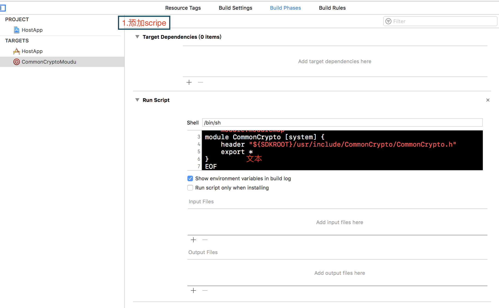

# Xcode 在OC、swift混编时报错错误内容
```
missing required module 'CommonCrypto'

```
#### 出错原因：
`
由于苹果的C语言库在swift中没有对应的framework，所以OC框架在使用c语言库后作为外部框架导入后找不到原c语言框架
`
#### 解决方法
`
新建对应的虚拟Framework（在此使用脚本自动生成模块并映射正确的Xcode/SDK路径），然后加入到项目依赖中，护体方法如下
`
1. 选择xcode工程文件
2. 选择`info`选项
3. 添加`target`->`Aggregate`
4. 添加Script将如下脚本粘贴到图示处
5. 选择`Build Phases`选项，将CommonCrypto框架添加到`Target Dependencies`  

